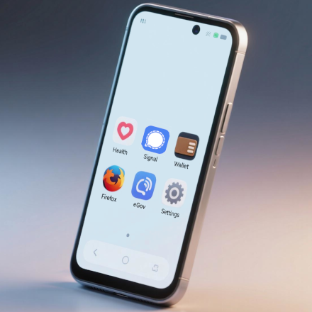
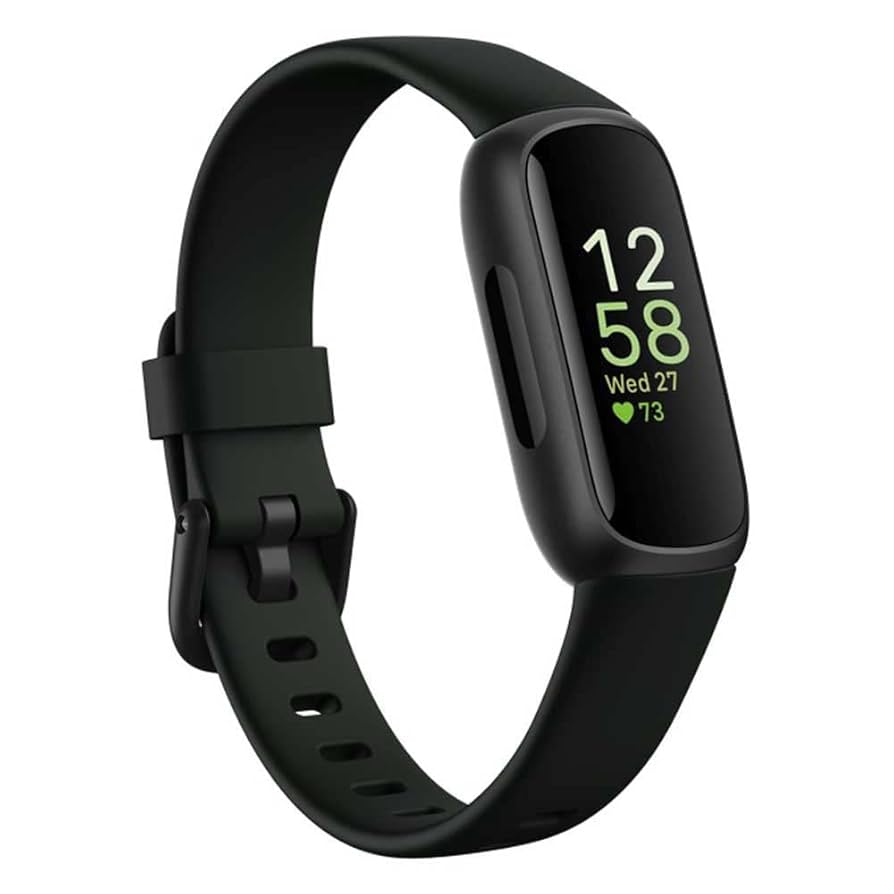
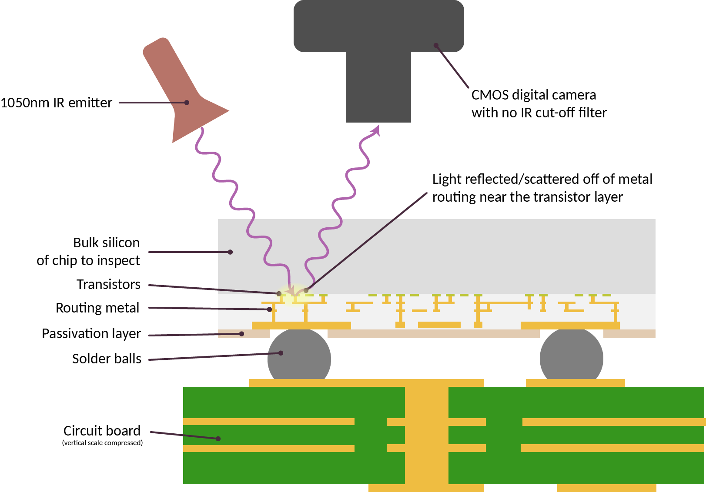
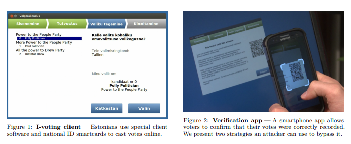
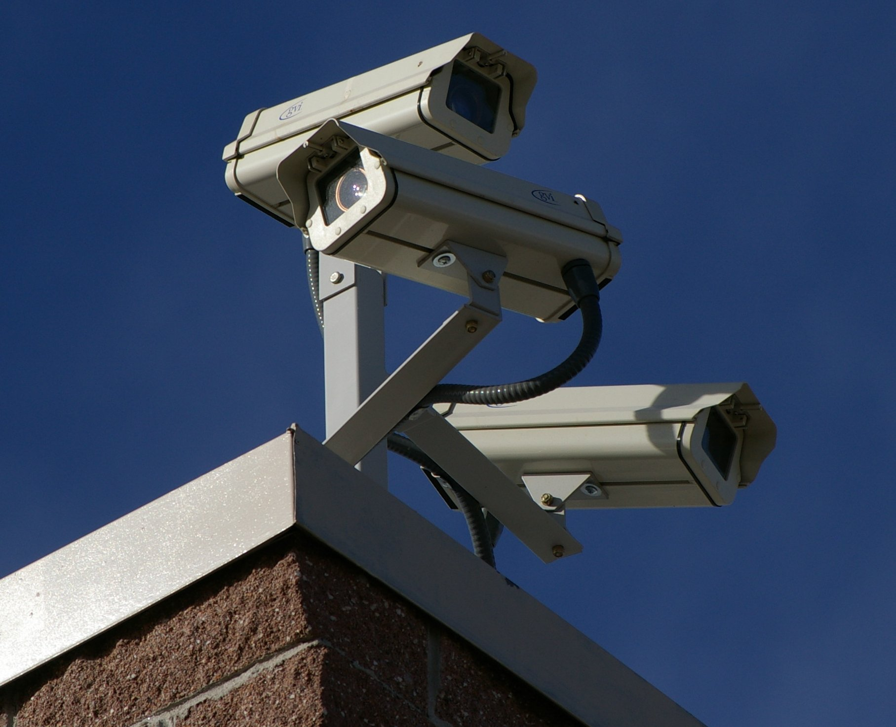
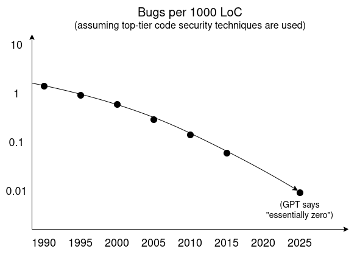
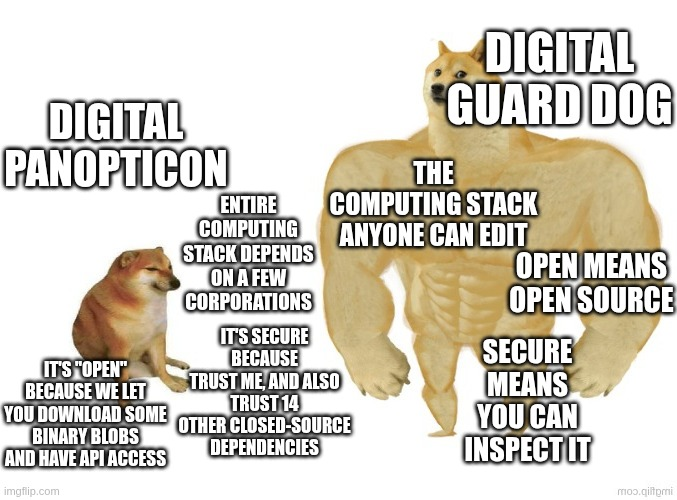

# The importance of full-stack openness and verifiability

Dark Mode Toggle

#  The importance of full-stack openness and verifiability 
 2025 Sep 24 
[See all posts](../../../../index.html)

 The importance of full-stack openness and verifiability 

 *Special thanks to Ahmed Ghappour, bunnie, Daniel Genkin,
Graham Liu, Michael Gao, mlsudo, Tim Ansell, Quintus Kilbourn, Tina
Zhen, Balvi volunteers and GrapheneOS developers for feedback and
discussion.* 

Perhaps the biggest trend of this century so far can be summarized by
the phrase "the internet has become real life". It started with email
and instant messaging. Private conversations that for millennia past
were done with mouths, ears, pen and paper, now run on digital
infrastructure. Then, we got digital finance - both crypto finance, and
digitization of traditional finance itself. Then, our health: thanks to
smartphones, personal health tracking watches, and data inferred from
purchases, all kinds of information about our own bodies is being
processed through computers and computer networks. Over the next twenty
years, I expect this trend to take over all kinds of other domains,
including various government processes (eventually even voting),
monitoring of the public environment for physical and biological
indicators and threats, and ultimately, with brain-computer interfaces,
even our own minds.

I do not think that these trends are avoidable; their benefits are
too great, and in a highly competitive global environment, civilizations
that reject these technologies will lose first competitiveness and then
sovereignty to those that embrace them. However, in addition to offering
powerful benefits, **these technologies deeply affect power
dynamics, both within and between countries**.

The civilizations that gained the most from new waves of technology
are not the ones who *consumed* the technology, but the ones who
*produced* it. Centrally planned equal access programs to
locked-down platforms and APIs can at best provide only a small fraction
of this, and fail in circumstances that fall outside of a pre-determined
"normal". Additionally, this future involves a lot of **trust
being put in technology**. If that trust is broken (eg.
backdoors, security failures), we get really big problems. Even the mere
*possibility* of that trust being broken forces a fallback to
fundamentally exclusionary social models of trust ("was this thing built
by people I trust?"). This creates incentives that propagate up the
stack: the sovereign is he who decides on the state of exception.

Avoiding these problems requires technology across the stack -
**software, hardware and bio** - that has two intertwined
properties: **genuine openness (ie. open source, including free
licensing)** and **verifiability (including, ideally,
directly by end users)**.

 *The internet is real life. We want it to become a utopia
and not a dystopia.* 

## The
importance of openness and verifiability in health
We saw the consequences of unequal access to the technological means
of production during Covid. Vaccines were produced in only a few
countries, which led to [large
disparities](https://www.ucl.ac.uk/bartlett/news/2025/apr/new-research-finds-substantial-global-disparities-covid-19-vaccine-accessibility) between when different countries were able to get access
to them. Wealthier countries got top-quality vaccines in 2021, others
got lower-quality vaccines in 2022 or 2023. There were [initiatives
to try to ensure equal access](https://www.who.int/initiatives/act-accelerator/covax), but because the vaccines were
designed to rely on capital-intensive proprietary manufacturing
processes that could only be done in a few places, these initiatives
could only do so much.

 *Covid vaccine coverage, 2021-23.* 

The *second* major issue with vaccines was the [opaque](https://www.nytimes.com/2021/01/28/world/europe/vaccine-secret-contracts-prices.html)
science and communications [strategy](https://jphe.amegroups.org/article/view/9331/html)
that tried to pretend to the public that they carried literally zero
risks or downsides, which was untrue and ended up [contributing
greatly](https://www.transparency.org/en/press/covid-19-vaccines-lack-of-transparency-trials-secretive-contracts-science-by-press-release-risk-success-of-global-response) to [mistrust](https://www.sciencedirect.com/science/article/pii/S0264410X24007217).
Today, this mistrust has spiraled into what feels like a rejection of
half a century of science.

In fact, both problems are resolvable. Vaccines like the [Balvi](https://x.com/VitalikButerin/status/1567908552714616832)-funded
[PopVax](https://popvax.com/) are cheaper to develop, and
made with a much more open process, reducing access inequality and at
the same time making it easier to analyze and verify their safety and
effectiveness. We can go even further in designing vaccines for
verifiability first.

Similar issues apply for the **digital side of
biotech**. When you talk to longevity researchers, one of the
first things that you will universally hear is that the future of
anti-aging medicine is *personalized* and *data-driven*.
To know what medicines and what changes in nutrients to suggest to a
person today, you need to know the current condition of their body. This
is much more effective if there can be **a large amount of data
digitally collected and processed, in real time**.

 *This watch collects 1000x more data about you than
Worldcoin. This has upsides and downsides.* 

The same idea applies for defensive biotech aimed at downside
prevention, such as **fighting pandemics**. The earlier a
pandemic is detected, the more likely it is that it can be stopped at
the source - and even if it can't, each week gives more time to prepare
and start working on countermeasures. While a pandemic is ongoing, there
is a lot of value in being able to know in what locations people are
getting sick, in order to deploy countermeasures in real time. If the
average person who gets sick with a pandemic learns it, and
self-isolates within an hour, that implies up to 72x less spread than if
they go around infecting others for three days. If we know which 20% of
*locations* are responsible for 80% of the spread, improving air
quality there can add further gains. All of this requires (i)
**lots and lots of sensors**, and (ii) the ability for the
**sensors to communicate in real time** to feed information
to other systems.

And if we go even further in the "scifi" direction, we get to
**brain-computer interfaces**, which can enable great
productivity, help people better understand each other through
telepathic communication, and unlock safer paths to highly intelligent
AI.

If the infrastructure for biological and health tracking (for
individuals and for spaces) is proprietary, then the data goes into the
hands of large corporations by default. Those corporations have the
ability to build all kinds of applications on top, and others do not.
They may offer it via API access, but API access will be limited and
used for monopolistic rent extraction, and can be taken away at any
time. This means that a small number of people and corporations have
access to the most important ingredients for a major area of 21ˢᵗ
century technology, which in turn limits who can economically benefit
from it.

And on the other hand, if this kind of personal health data is
insecure, someone who hacks it can blackmail you over any health issues,
optimize pricing of insurance and healthcare products to extract value
from you, and if the data includes location tracking they know where to
wait for you to kidnap you. And in the other direction, your location
data ([very](https://www.nbcnews.com/tech/security/location-data-broker-gravy-analytics-was-seemingly-hacked-experts-say-rcna187038)
often [hacked](https://www.nytimes.com/interactive/2019/12/19/opinion/location-tracking-cell-phone.html))
can be used to infer information about your health. If your BCI gets
hacked that means a hostile actor is literally reading (or worse,
writing) your mind. This is no longer science fiction: see [here](https://www.sciencedirect.com/science/article/abs/pii/S0165027022002357)
for a plausible attack by which a BCI hack can lead to someone losing
motor control.

All in all, a huge amount of benefits, but also significant risks:
risks that a strong emphasis on openness and verifiability are very well
suited to mitigating.

## The
importance of openness and verifiability in personal and commercial
digital tech
Earlier this month I had to fill in and sign a form that was required
for a legal function. At the time I was not in the country. A national
electronic signing system existed, but I did not have it set up at the
time. I had to print out the form, sign it, walk over to a nearby DHL,
spend a bunch of time filling in the paper form, and then paying for the
form to be express-shipped halfway across the world. Time required: half
an hour, cost: $119. On that same day I had to sign a (digital)
transaction to perform an action on the Ethereum blockchain. Time
required: 5 seconds, cost: $0.10 (and, to be fair, without the
blockchain a signature can be completely free).

These kinds of stories are easy to find in corporate or nonprofit
governance, management of intellectual property rights, and much more.
For the past decade, you can find them in the pitch decks of a
significant fraction of all blockchain startups. And on top of this,
there is the mother of all use cases of "digitally exercising personal
authority": payments and finance.

There is of course a big risk in all this: what if either the
software or the hardware gets hacked? This is a risk that the crypto
space was early to recognize: the blockchain is permissionless and
decentralized, and so if you [lose
access to your funds](https://bitcoinmagazine.com/culture/bitcoin-self-defense-part-i-wallet-protection-1368758841), there is no resource, no uncle in the sky that
you can call for help. Not your keys, not your coins. For this reason,
the crypto space was early to thinking about [multisig](https://bitcoinmagazine.com/technical/multisig-future-bitcoin-1394686504)
and [social
recovery wallets](https://vitalik.eth.limo/general/2021/01/11/recovery.html), and [hardware
wallets](https://www.coinbase.com/en-sg/learn/crypto-basics/what-is-a-hardware-wallet). In reality, however, there are many situations where lack
of a trusted uncle in the sky is not an ideological choice, but an
inherent part of the scenario. In fact, even in traditional finance, the
"uncle in the sky" fails to protect most people: for example, [only
4% of scam victims recover their losses](https://www.gasa.org/post/global-state-of-scams-report-2024-1-trillion-stolen-in-12-months-gasa-feedzai#:~:text=Only%204%25%20of%20Victims%20Recover,more%20effective%20financial%20recovery%20processes.). In use cases that involve
custody of *personal data*, reverting a leak is impossible even
in principle. Hence, **we need true verifiability and security -
of both the software and, ultimately, the hardware**.

 [*One
proposed technique*](https://www.bunniestudios.com/blog/2023/infra-red-in-situ-iris-inspection-of-silicon/) *for inspecting that computer chips were
manufactured correctly.* 

Importantly, in the case of hardware, **the risk that we are
trying to prevent goes far beyond "is the manufacturer evil?". Rather,
the problem is that there is a large number of dependencies, most of
which are closed source, and any one of them being negligent can cause
unacceptable security outcomes**. [This paper shows recent
examples](https://eprint.iacr.org/2024/574.pdf) of how microarchitecture choices can undermine the
side-channel resistance of designs that are *provably secure* in
a model that looks at the software alone. Attacks like [EUCLEAK](https://ninjalab.io/eucleak/) depend on
vulnerabilities that are much harder to find because of how many
components are proprietary. AI models can have backdoors inserted at
training time [if they are
trained on compromised hardware](https://arxiv.org/pdf/2304.08411).

Another issue in all of these cases is downsides from closed and
centralized systems, even if they are perfectly secure. Centralization
creates *ongoing leverage* between individuals, companies or
countries: if your core infrastructure is built and maintained by a
potentially untrustworthy company in a potentially untrustworthy
country, you are vulnerable to pressure (eg. see [Henry
Farrell on weaponized interdependence](https://www.brookings.edu/wp-content/uploads/2020/05/9780815738374_ch1.pdf)). This is the sort of problem
that crypto is meant to solve - but it exists in far more domains than
just the financial.

## The
importance of openness and verifiability in digital civic tech
I frequently talk to people of various stripes who are trying to
figure out better **forms of government** that are well
suited for their various contexts in 21ˢᵗ century. Some, like [Audrey Tang](https://6pack.care/manifesto), are trying to take
political systems that are already functional and bring them to the next
level, empowering local open-source communities and using mechanisms
like citizens' assemblies, sortition and quadratic voting. Others are
starting from the bottom: [here is a](https://www.igrec.io/constitution-project)
constitution recently proposed by some Russian-born political scientists
for Russia, featuring strong guarantees of individual freedom and local
autonomy, strong institutional bias toward peace and against aggression,
and an unprecedentedly strong role for direct democracy. Others, like
economists [working on land
value tax](https://www.landisabigdeal.com/) or congestion pricing, are trying to **improve their
country's *economics***.

Different people may have different levels of enthusiasm for each
idea. But one thing that they all have in common is they **all
involve *high-bandwidth participation*, and so any realistic
implementation has to be *digital***. Pen and paper is
okay for a very basic record of who owns what and elections run once
every four years, but not for anything that asks for our input with
higher bandwidth or frequency.

Historically, however, security researchers' reception to the idea of
things like electronic voting has ranged from skeptical to hostile. [Here
is a good summary](https://cs.stanford.edu/people/eroberts/cs181/projects/2006-07/electronic-voting/index_files/page0002.html) of the case against electronic voting. Quoting
from that document:

First of all, the technology is "black box software," meaning that
the public is not allowed access into the software that controls the
voting machines. Although companies protect their software to protect
against fraud (and to beat back competition), this also leaves the
public with no idea of how the voting software works. It would be simple
for the company to manipulate the software to produce fraudulent
results. Also, the vendors who market the machines are in competition
with each other, and there is no guarantee that they are producing the
machines in the best interest of the voters and the accuracy of the
ballots.

There are lots of [real-world
cases](https://apnews.com/article/f6876669cb6b4e4c9850844f8e015b4c) that justify this skepticism.

 *A* [*critical
analysis*](https://jhalderm.com/pub/papers/ivoting-ccs14.pdf) *of Estonian internet voting, 2014.*

These arguments apply verbatim in all kinds of other situations. But
I predict that as technology progresses, the "let's not do it at all"
response will become less and less realistic, across a wide range of
domains. The world is rapidly becoming more efficient (for better or
worse) due to technology, and I predict that any system that does not
follow this trend will become less and less relevant to individual and
collective affairs as people route around it. And so we need an
alternative: to actually do the hard thing and figure out how to make
complicated tech solutions secure and verifiable.

Theoretically, "secure and verifiable" and "open-source" are two
different things. **It is definitely possible for something to be
proprietary and secure**: airplanes are highly proprietary
technology but on the whole commercial aviation is a [very
safe way to travel](https://www.linkedin.com/pulse/beyond-intuition-why-flying-really-safer-than-driving-philip-mann-15tee)**. But what a proprietary model
*cannot* achieve is common knowledge of security** - the
ability to be trusted by mutually distrusting actors.

Civic systems like elections are one type of situation where common
knowledge of security is important. Another is evidence gathering in
courts. Recently, in Massachusetts, a large volume breathalyzer evidence
[was
ruled invalid](https://www.wbur.org/news/2023/04/27/massachusetts-breathalyzer-court-ruling-newsletter) because information about faults in the tests was
found to have been covered up. Quoting the article:

Wait, so were all of the results faulty? No. In fact, there weren't
calibration issues with the breathalyzer tests in most of the cases.
However, since investigators later found that the state crime lab
withheld evidence showing the problems were more widespread than they
said, Justice Frank Gaziano wrote that all of those defendants had their
due process rights violated.

Due process in courts is inherently a domain where what is required
is not just fairness and accuracy, but common knowledge in fairness and
accuracy - because if there is not common knowledge that courts are
doing the right thing, society can easily spiral into people taking
matters into their own hands.

In addition to verifiability, there are also inherent benefits to
openness itself. Openness allows local groups to design systems for
governance, identity, and other needs in ways that are compatible with
local goals. If voting systems were proprietary, then a country (or
province or town) that wanted to experiment with a new one would have a
much harder time: they would have to either convince the company to
implement their preferred rules as a feature, or start from scratch and
go through all the work to make it secure. This adds a high cost to
innovation in political systems.

A more open-source hacker-ethic approach, in any of these areas,
would put more agency in the hands of local implementers, whether they
are acting as individuals or as part of governments or corporations. For
this to be possible, open tools for building need to be widely
available, and the infrastructure and code bases need to be freely
licensed to allow others to build on top. To the extent that the goal is
minimizing power differentials, [copyleft
is especially valuable](https://vitalik.eth.limo/general/2025/07/07/copyleft.html).

A final area of civic tech that will matter in the next years is
**physical security**. Surveillance cameras have been
popping up everywhere over the past two decades, causing many civil
liberties worries. Unfortunately, I predict that the recent rise of
drone warfare will make "don't do high tech security" no longer a viable
option. Even if a country's own laws do not infringe on a person's
freedom, that means nothing if the country cannot protect you from
*other countries* (or rogue corporations or individuals) imposing
their laws on you instead. Drones make such attacks much easier. Ergo,
we need countermeasures, that will likely involve lots of [counter-drone
systems](https://www.robinradar.com/resources/10-counter-drone-technologies-to-detect-and-stop-drones-today) and sensors and cameras.

If these tools are proprietary, data collection will be opaque and
centralized. If these tools are open and verifiable, then we have a
chance at a better approach: **security equipment that provably
outputs only a limited amount of data in a limited number of situations
and deletes the rest**. We could have a digitized physical
security future that is **more like digital guard dogs than a
digital panopticon**. One could imagine a world where public
monitoring devices are required to be open source and verifiable, and
anyone has a legal right to randomly choose a monitoring device in
public and take it apart and verify it. University computer science
clubs could frequently do this as an educational exercise.

## The open source and
verifiable way
We cannot avoid having digital computer things that are deeply
embedded in all kinds of aspects of our (personal and collective) lives.
By default, we will likely get digital computer things that are built
and run by centralized corporations, optimized for a few people's profit
motives, backdoored by their host governments, and where most of the
world has no way to participate in their creation or know if they're
secure. But we can try to steer toward a better alternative.

Imagine a world where:

- You have a **secure personal electronic device** -
something with the power of a phone, the security of a crypto hardware
wallet and a level of inspectability not quite like a mechanical watch,
but pretty close.
- Your **messaging apps are all encrypted**, message
patterns obfuscated with mixnets, and all the **code formally
verified**. You are able to have confidence that your private
communications actually are private.
- Your **finances** are standardized ERC20 assets onchain
(or on some server that publishes hashes and proofs to a chain to
guarantee correctness), managed by a wallet controlled by your personal
electronic device. If you lose your device, they are [recoverable
with some combination](https://vitalik.eth.limo/general/2021/01/11/recovery.html) (that you choose) of your other devices,
devices of family members, friends or institutions (not necessarily
governments: if it's easy for anyone to do this, eg. churches may well
offer it too).
- **Open-source versions of Starlink-like infrastructure
exist**, so we get robust global connectivity without dependence
on a few individual actors.
- You have **on-device open-weight LLMs** scanning your
activity, offering suggestions and autocompleting tasks, and warning you
when you are potentially getting incorrect information or about to make
a mistake.
- The **operating system** is also open-source and
formally verified.
- You are **wearing 24/7 personal health tracking
equipment**, which is also **open source and
inspectable**, allowing you to get your data and making sure no
one else is getting it without your consent.
- We have more **advanced forms of governance** that use
sortition, citizens' assemblies, quadratic voting, and generally clever
combinations of democratic votes to set goals and some method of
selecting ideas from experts to determine how the goals are achieved. As
a participant, you can actually be confident that the system is
implementing the rules as you understand them.
- **Public spaces are fitted with monitoring equipment to track
bio variables** (eg. CO2 and AQI levels, presence of airborne
diseases, wastewater). However, this equipment (along with any
surveillance cameras and defensive drones) is **open source and
verifiable**, and a legal regime exists by which the public can
randomly inspect it.

This is a world where we have much more safety and freedom and equal
access to the global economy than today. But making this world happen
requires much more investment in various technologies:

- **More advanced forms of cryptography.** What I call
the [Egyptian
god cards of cryptography](https://vitalik.eth.limo/general/2024/10/29/futures6.html#5) - [**ZK-SNARKs**](https://vitalik.eth.limo/general/2021/01/26/snarks.html),
[**fully
homomorphic encryption**](https://vitalik.eth.limo/general/2020/07/20/homomorphic.html) and [**obfuscation**](https://medium.com/@laurippeltonen/indistinguishable-obfuscation-wait-what-49ed87a445aa)
- are so powerful because they let you compute arbitrary programs on
data in multi-party contexts, and give guarantees about the output,
while keeping the data and the computation private. This enables much
more powerful applications that are privacy-preserving. Tools adjacent
to cryptography (eg. **blockchains** to enable applications
with strong guarantees that data is not tampered with and users are not
excluded, and **differential privacy** to add noise to data
to further preserve privacy) also apply here.
- **Application and user-level security**. Applications
are only secure if the security assurances that they make are actually
intelligible and verifiable by the user. This will involve software
frameworks that make applications with strong security properties easy
to build. Importantly, it will also involve browsers, operating systems
and other intermediaries (eg. locally running watcher LLMs) all doing
their part to verify applications, determine their level of risk, and
present this information to the user.
- **Formal verification.** We can use automated proving
methods to algorithmically verify that programs satisfy properties that
we care about, eg. in terms of not leaking data or not being vulnerable
to unauthorized third-party modification. [Lean](https://lean-lang.org/) has recently become a popular
language for this. These techniques are already starting to be used to
verify ZK-SNARK proving algorithms for the Ethereum virtual machine
(EVM) and other high-value high-risk use cases in crypto, and are
similarly being used in the wider world. On top of this, we need further
progress in other, more mundane security practices.

 *The cybersecurity fatalism of the 00s is wrong: bugs (and
backdoors) can be beaten. We "just" have to learn to value security more
than other competing goals.* 

- **Open-source and security-focused operating
systems.** More and more of these are starting to pop up: [GrapheneOS](https://grapheneos.org/) as a security-focused
version of Android, minimal security-focused kernels like [Asterinas](https://github.com/asterinas/asterinas), and
Huawei's HarmonyOS (which has an [open source version](https://www.openharmony.cn/mainPlay)) is
[using
formal verification](https://consumer.huawei.com/ae-en/community/details/topicId-108910/) (I expect many readers will think "if it's
Huawei, surely it has backdoors", but this misses the whole point:
*it shouldn't matter who produces something, as long as it's open and
anyone can verify it*. This is a great example of how openness and
verifiability can fight against global balkanization)

- **Secure open-source hardware**. No software is
secure if you can't be sure that your hardware is actually running that
software, and is not leaking data separately on the side. I am most
interested in two short-term targets in this regard:

A **personal secure electronic device** - what
blockchain people call a "hardware wallet" and open source enthusiasts
call a "secure phone", except once you understand the need for security
and generality, the two ultimately converge to being the same
thing.
- **Physical infrastructure for public spaces** - smart
locks, bio monitoring equipment as I described above, and general
"internet of things" tech. We need to be able to trust it. This requires
open source and verifiability.

**Secure open toolchains for building open-source
hardware**. Today, designing hardware depends on a whole series
of closed-source dependencies. This drastically raises the cost of
making hardware, and makes the process much more permissioned. It also
makes hardware verification impractical: if the tooling that generates
the chip design is closed source, you don't know what you're verifying
against. Even tools like [scan chains](https://en.wikipedia.org/wiki/Scan_chain) that
exist today are often unusable in practice because too much of the
necessary tooling is closed source. This can all be changed.

**Hardware verification** (eg. [IRIS](https://www.bunniestudios.com/blog/2023/infra-red-in-situ-iris-inspection-of-silicon/),
and [X-ray scanning](https://pwd.aa.ufl.edu/paine/)). We need
ways of scanning chips to verify that they actually have the logic that
they are supposed to have, and that they do not have extra components
that allow unexpected forms of tampering and data extraction. This can
be done *destructively*: auditors randomly order products
containing computer chips (using identities that appear to be average
end users), and then take the chips apart and verify that the logic
matches up. With IRIS or X-ray scanning, it can be done
*non-destructively*, allowing *every* chip to potentially
be scanned.

To achieve common knowledge of trust, we ideally want
**hardware verification techniques that are within reach of large
groups of people**. X-ray machines today are not yet in this
position. This situation can be improved in two ways. First, we can
refine verification equipment (and verification-friendliness of chips)
so that the equipment is more widely accessible. Second, we can
supplement "full verification" with more limited forms of verification
that can even be done on smartphones (such as [ID
tags](https://news.mit.edu/2024/tiny-tamper-proof-id-tag-can-authenticate-almost-anything-0218) and signatures from keys generated by [physical
unclonable functions](https://en.wikipedia.org/wiki/Physical_unclonable_function)), that verify more restrictive claims like "was
this machine part of a batch that was produced by a known manufacturer,
of which a random sample is known to have been verified in detail by
third-party groups?"

**Open source, low-cost, local environmental and bio
monitoring equipment**. It should be possible for communities and
individuals to measure their environment and themselves and identify
biological risks. This includes technology in many form factors:
personal-scale medical equipment like [OpenWater](https://www.openwater.health/), air quality sensors,
universal airborne disease sensors (eg. [Varro](https://varrobio.com/)), and larger-scale environmental
monitoring.

 *Openness and verifiability on every layer of the stack
matters* 

## From here to there
A key difference between this vision and a more "traditional" vision
of technology is that it's much more friendly to local sovereignty and
individual empowerment and freedom. Security is done less by scouring
the entire world and making sure there are zero bad guys anywhere, and
more by making the world more robust at every level. Openness means
openness to build upon and improve every layer of technology, and not
just centrally planned open-access API programs. Verification is not
something reserved to proprietary rubber-stamp auditors that may well be
colluding with the companies and governments rolling out the technology
- it's a right, and a socially encouraged hobby, for the people.

I believe that this vision is more robust, and more compatible with
our fractured global twenty-first century. But we do not have infinite
time to execute on this vision. Centralized approaches to security, that
involve putting *more* centralized data collection and backdoors,
and reducing verification entirely to "was this made by a trusted
developer or manufacturer", are moving forward rapidly. Centralized
attempts to substitute for true open access have been attempted for
decades. It started perhaps with Facebook's [internet.org](https://www.wired.com/story/what-happened-to-facebooks-grand-plan-to-wire-the-world/),
and it will continue, each attempt more sophisticated than the last. We
need to both move quickly to compete with these approaches, and make the
public case, to people and institutions, that a better solution is
possible.

If we can succeed in this vision, one way to understand the world
that we get is that it is a kind of retro-futurism. On the one hand, we
get the benefits of much more powerful technologies allowing us to
improve our health, organize ourselves in much more efficient and
resilient ways, and protect ourselves against threats, both old and new.
On the other hand, we get a world that brings back properties that were
second-nature to everyone back in 1900: the infrastructure is free for
people to take apart, verify and modify to suit their own needs, anyone
is able to participate not just as a consumer or an "app builder", but
at any layer of the stack, and anyone is able to have confidence that a
device does what it says it does.

Designing for verifiability has a cost: many optimizations to both
hardware and software deliver highly-demanded gains in speed come at the
cost of making the design more inscrutable or more fragile. Open source
makes it more challenging to make money under many standard business
models. I believe that both issues are overstated - but this is not
something that the world will be convinced of overnight. This leads to a
question: **what is the pragmatic short-term goal to shoot
for**?

I will propose one answer: work toward a fully open-source and
verification-friendly stack targeted toward high-security,
non-performance-critical applications - both consumer and institutional,
long-distance and in-person. This would include hardware and software
and bio. Most computation that *really needs security* does not
*really need speed*, and even in the cases where it does, there
are often ways to [combine
performant-but-untrusted and trusted-but-not-performant components](https://vitalik.eth.limo/general/2024/09/02/gluecp.html)
to achieve high levels of performance and trust for many applications.
It is unrealistic to achieve maximum security and openness for
everything. But we can start by ensuring that these properties are
available in those domains where they really matter.

## 文章图片

